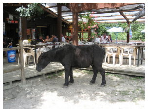

# Image Captioning

## Introduction

The purpose of this project is to provide captions given an image.

#### Sample Data from COCO

Below is a sample image from COCO dataset with its possible captions, outputting these captions is our objective.


```
A black horse is standing in the sand, with people in the background. 
a miniature horse walking near a restaurants outside deck 
there is a small black pony in the sand
A donkey standing in front of a restaurant.
A large horse standing inside of a wooden pen.
```


This is done using CNN-RNN model. CNN will encode the image into a feature vector, then the RNN will decode while also building an Embedding layer of vocabularies which translate image pixels data into captions.

The CNN model used is a pretrained ResNet50, while the RNN used is an LSTM trained using teacher-forcer method.


## Dataset

Dataset is provided by [COCO](http://cocodataset.org/#home), a provider of dataset for object detection and captioning.
Due to the massive size of the dataset, it is not included in this repo. Please download the 2014 image and annotation dataset from the [COCO website](http://cocodataset.org/#download).

## Dependencies

This project make use of Anaconda-distributed Python 3.7, PyTorch, NLTK, and CocoApi

A Conda environment file is provided in this repo.


## Training & Inference

this repo includes a pretrained model and a prebuilt vocab.

to retrain, please use jupyter notebook and open `train.ipynb`
Run all the cells to train a model and built the vocab

for inference, open `inference.ipynb` and follow the instruction in the notebook

### Sample Inference

sample images and resulting caption from the inference


(Image by <a href="https://pixabay.com/users/Couleur-1195798/?utm_source=link-attribution&amp;utm_medium=referral&amp;utm_campaign=image&amp;utm_content=5091308">Couleur</a> from <a href="https://pixabay.com/?utm_source=link-attribution&amp;utm_medium=referral&amp;utm_campaign=image&amp;utm_content=5091308">Pixabay</a>)

```
a vase filled with flowers sitting on a table .
```


(Image by <a href="https://pixabay.com/users/Makalu-680451/?utm_source=link-attribution&amp;utm_medium=referral&amp;utm_campaign=image&amp;utm_content=4767882">Makalu</a> from <a href="https://pixabay.com/?utm_source=link-attribution&amp;utm_medium=referral&amp;utm_campaign=image&amp;utm_content=4767882">Pixabay</a>)

```
a person is standing on a snowy mountain .
```

## Conclusion and Further Work

As we can see from the sample inference, the resulting captions are not really accurate, but it's not completely incorrect either. 

I think that the model has not reached its full potential yet. This is mostly due to hardware constraint. Images are resized into a 224x224 pixels, due to the use of a ResNet model which accept this size as input and also due to the limitation of GPU memory. To truly capture the detail of an image, a higher resolution input might be needed.

The number of epochs done in the training is minimal, again this is due to hardware constraint. Training an epoch require almost one hour to complete. As such, this model is only trained with **one epoch**. It is remarkable that the model is able to output a relevant caption given the epoch parameter.

The size of the embedding and hidden state size can be increased, but I was not available to do so as there was not enough GPU memory.